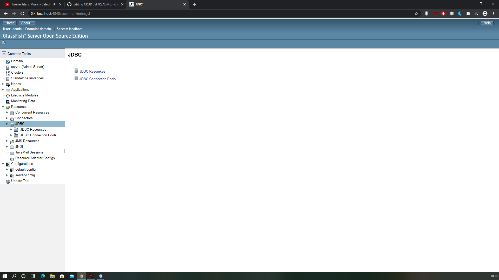

# CRUD_JSF

## Context du projet :
Récupérer un MEA (modèle entité-association) sur le site "Database Answers" (http://www.databaseanswers.org/data_models/). Ensuite, créer à partir du modèle entité-association 
un schéma relationnel. Enfin, créer une application web, un CRUD (Create, Read, Update, Delete), à partir du schéma relationnel. 

Obligation d'utiliser :
* un serveur GlassFish 
* les technologies JavaBeans et JSF

## Technos utilisées :
* JSF
* EJB (Entity Beans / Session Beans)
* JDBC
* Hibernate
* JPA
* Langages de programmation utilisés : JAVA / XHTML
* IDE utilisé : NetBeans

## Comment faire fonctionner le projet ?
* Installer NetBeans et la JDK 8
* Installer un serveur GlassFish version 4.1.2 accessible via ce <a href="https://drive.google.com/file/d/16tU203ZMTlK0soczpcv0zsKn0GBlOvMd/view?usp=sharing">lien</a> (c'est avec cette version que je travaillais) sur NetBeans 
* Créer votre base de données et alimenter la en utilisant le script SQL qui se trouve dans le dossier ScriptSQL "CRUD_JSF/ApartmentRentals_CSL_TAILLANDIERRemy/ScriptSQL/"
* Démarrer votre serveur de base de données et votre serveur d'applications GlassFish
* Configurer votre serveur GlassFish (vous trouverez dans la partie "Configuration du serveur GlassFish", les différentes étapes pour le faire)
* Ouvrer le projet "ApartmentRentals_CSL_TAILLANDIERRemy" sur NetBeans
* Démarrer le fichier index.xhtml "CRUD_JSF/ApartmentRentals_CSL_TAILLANDIERRemy/ApartmentRentals_CSL_TAILLANDIERRemy/web/"

## Configuration du serveur GlassFish :
* Accéder au panel d'administration du serveur :

* Création d'une ressource JDBC, pour la faire il faut :
  - Créer dans un premier temps une "JDBC Connection Pools" :
  
  
  
  
  
  
  
  
  
  - Ensuite d'une "JDBC Resources" :
  
  

